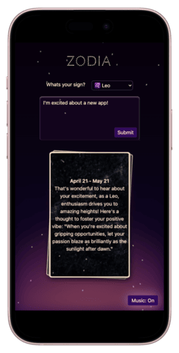
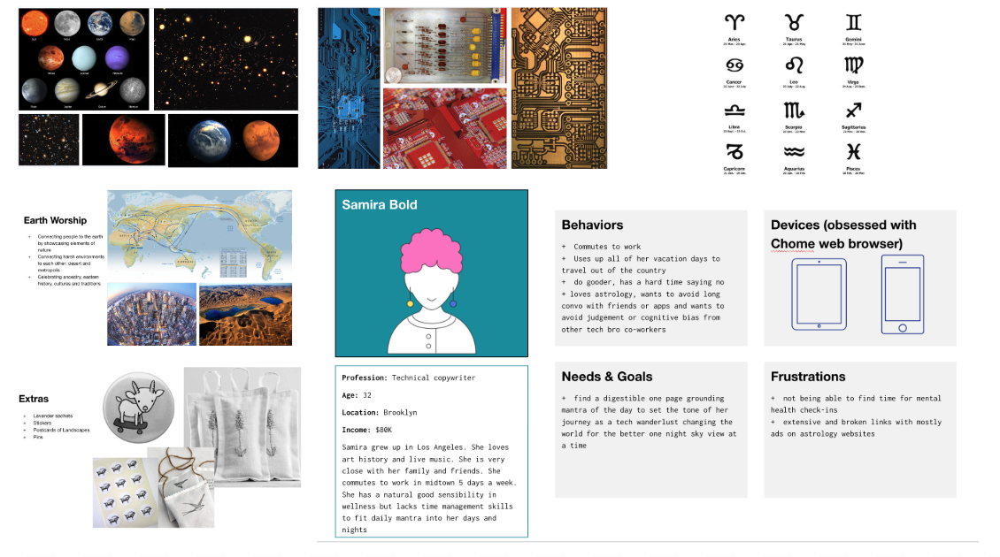
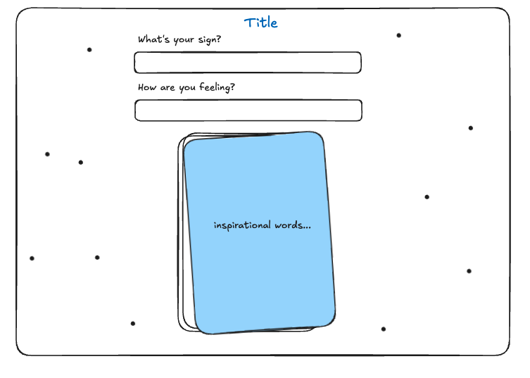
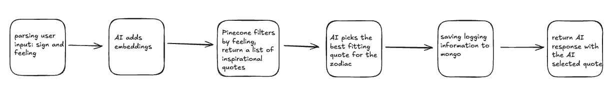
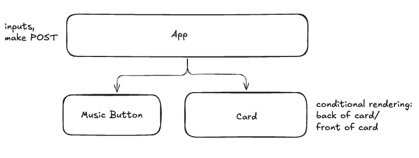
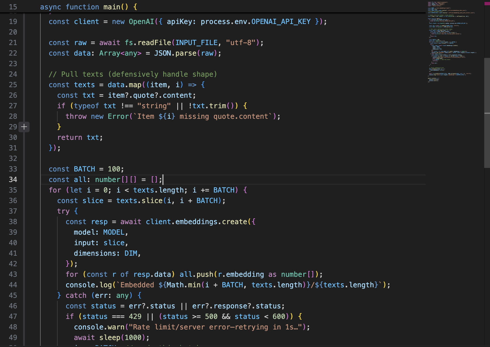
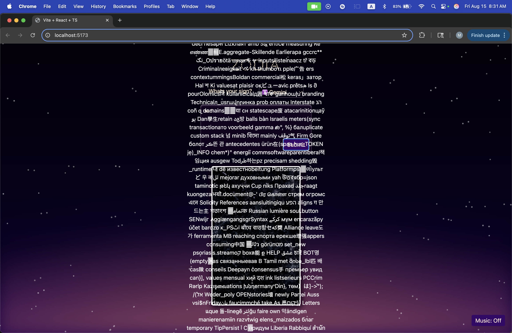

# Zodia

## User Story

A user that is filled with emotion (positive or negative) wants to share with someone but a family member or friend is not available.

### Solution:

Create an AI friend that can listen to your feelings and provide inspirational words to help you process them.

### Acceptance Criteria:

Users should be able to:

- Input 2 pieces of data: zodiac sign and feeling
- Receive an inspirational quote from the AI best suited for their current feeling in a 'voice' suited to their zodiac sign's personality traits.

## Mockups

#### Desktop Wireframe

#### Middleware Architecture

#### React Component Structure

#### Mongo DB Schema

## Technologies Used

- React: the app uses embedded javascript to render information on the page
- Typescript: the app uses typescript due to its enhancement being the addition of static typing
- Node & Express: the app has its own server, built using Express
- MVC Pattern: the app uses the Model View Controller (MVC) programming design pattern
- MongoDB: the app uses a non-relational database which simplifies data modeling as it aligns well with common data formats in web development
- Mongoose: to model and query data in MongoDB through Node
- Pinecone: to provide a fully managed, scalable, and user-friendly vector database that simplifies the process of indexing, storing, and searching high-dimensional vectors
- Tailwind.css: The app is efficiently well-designed and considers user experience and usability
- Postman: to test server requests during development
- Dotenv: to load environment variables from .env file
- Vite: for a fast modern development environment

## Major Coding Win

- Embedding the initial data
  

## Technical Challenges

- Disney
  - Resolving merge conflicts
  - Working with multiple branches
  - Styling: CSS
- Lisa
  - Working with software and time constraints
    - Nested objects in mongo schema
    - Typescript interfaces
  - Styling: Tailwind
  - Code reviews, Debugging, and Quality Assurance
- Michael
  - Initializing quote dataset with embeddings
  - Styling: hazing effect
- Tucker
  - AI prompting
  - Fine-tuning
  - Hallucinations
- Yuan
  - Music selection and component
  - React vs. prev React Native experience
  - Typescript

## Installation Instructions

1. Run `npm install` in root folder to install all necessary dependencies listed in the package.json
2. Create a `.env` file in the root. You'll need to have:
   a. `MONGO_URI` to connect to your MongoDB, which can be found in `server/config/db.ts`
   b. `OPENAI_API_KEY` to connect to OpenAI, which can be found in `server/controllers/openaiController.ts`
   c. `PINECONE_API_KEY`, to connect to the pinecone vector database.
   d. create a new index called `quotes` in Pinecone using `text-embedding-3-small` type and dimension `512`
   e. `PINECONE_INDEX`= "quotes" -
   f. run `npm run upsert-batch`. This will upsert the file in `offline/embeddings_data_with_vectors.json` to the Pinecone index,
   g. run `npm run zodiacInfo`. This will upsert the mongo databse with dates and traits about each zodiac sign. To verify the data existence on local mongush, run `brew services start mongodb-community` and then run `mongosh`, `show dbs`, `use {db name}`, `show collections`, `db.zodiacinfos.find()`
3. To launch the app locally run `npm start` from the root folder and navigate to **localhost:5173** in your browser.

## Unsolved Problems

- AI Hallucinations
  - 

## Next Steps

- add zodiac personaity traits to card
- handle text overflow on card content
- log page to see dated previous queries and responses
