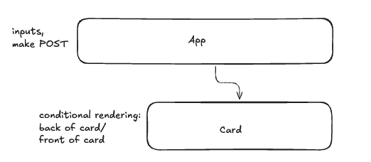

# Zodiac

## User Story

A user that is filled with emotion (positive or negative) wants to share with someone but a family member or friend is not available.

### Solution:

Create an AI friend that can listen to your feelings and provide inspirational quotes to help you process them.

### Acceptance Criteria:

Users should be able to:

- Input 2 pieces of data: zodiac sign and feeling
- Receive an inspirational quote from the AI best suited for their current feeling in a 'voice' suited to their zodiac sign's personality traits.

## Mockups

#### Desktop Wireframe

#### Middleware Architecture

#### React Component Structure

#### Mongo DB Schema

## Technologies Used

- React: the app uses embedded javascript to render information on the page
- React router: the app uses routner to setup a route of the game page
- Typescript: the app uses typescript due to its enhancement being the addition of static typing
- Node & Express: the app has its own server, built using Express
- MVC Pattern: the app uses the Model View Controller (MVC) programming design pattern
- Supabase/PostgreSQL: the app persists data via a relational database
- Mongoose: to model and query data in MongoDB through Node
- Tailwind.css: The app is efficiently well-designed and considers user experience and usability
- Postman: to test server requests
- Dotenv: to load environment variables from .env file
- Vite: for a fast modern development environment
- Vitest: testing framework (Jest support for ECMAScript Modules is still experimental)
- React testing library: to write unit tests for React components (works on top of react-dom which was already included)

## Major Coding Wins

## Technical Challenges

- ## Disney
- ## Lisa
- ## Michael
- ## Yuan

## Installation Instructions

1. Run `npm install` in root folder to install all necessary dependencies listed in the package.json
2. Create a `.env` file in the root. You'll need to have:
   a. `MONGO_URI` to connect to your MongoDB, which can be found in `server/config/db.ts`
   b. `OPENAI_API_KEY` to connect to OpenAI, which can be found in `server/controllers/openaiController.ts`
   c. `PINECONE_API_KEY`, to connect to the pinecone vector database.
   d. create a new index called `quotes` in Pinecone using `text-embedding-3-small` type and dimension `512`
   e. `PINECONE_INDEX`= "quotes" -
   f. run `npm run upsert-batch`. This will upsert the file in `offline/embeddings_data_with_vectors.json` to the Pinecone index,
3. To launch the app locally run `npm start` from the root folder and navigate to **localhost:5173** in your browser.

## Unsolved Problems

-

## Next Steps

-
